<picture>
  <source media="(prefers-color-scheme: dark)" srcset="assets/header-dark.svg">
  <source media="(prefers-color-scheme: light)" srcset="assets/header-light.svg">
  
</picture>

<br>

I work below the dApp layer: ante handlers, precompiles, token access control, MEV pipelines. Most of my time goes into **Cosmos SDK / cosmos-evm** chain code, **Solana** programs in Rust, and **Solidity** where it still makes sense. I like tests that fail first, small diffs, and writing down why a decision was made.

```text
$ whoami --now
  → fixing gas accounting & ante wiring in cosmos/evm
  → shipping ThawGate (KYC gates for Solana's Token ACL) on devnet
  → tuning ArbEngine Pro, my Solana arbitrage engine
```

<br>

## ◆ upstream

Pull requests to projects I don't own.

| repo | pr | what it does | state |
|:--|:--|:--|:--|
| [`cosmos/evm`](https://github.com/cosmos/evm) | [#1317](https://github.com/cosmos/evm/pull/1317) | Precompiles now charge the gas a native action consumed even when that action errors |  |
| [`cosmos/evm`](https://github.com/cosmos/evm) | [#1316](https://github.com/cosmos/evm/pull/1316) | Sets the fee-recipient module when building the ante handler — fixes a panic on restarted nodes ([#1288](https://github.com/cosmos/evm/issues/1288)) |  |
| [`vivarium-collective/process-bigraph`](https://github.com/vivarium-collective/process-bigraph) | [#231](https://github.com/vivarium-collective/process-bigraph/pull/231) | Opt-in debug check that validates process / step update outputs ([#99](https://github.com/vivarium-collective/process-bigraph/issues/99)) |  |

<br>

## ◆ built

<table>
<tr>
<td width="50%" valign="top">

**[ThawGate](https://github.com/AryaSingh22/thawgate)** &nbsp;`solana` `typescript`<br>
KYC and sanctions gates for Solana's Token ACL (sRFC 37). Holders unlock a regulated token themselves with a valid credential and lose access when it's revoked — no transfer hook, so the token still works in DeFi. Ships an Anchor gate, [`@thawgate/sdk`](https://www.npmjs.com/package/@thawgate/sdk), [`@thawgate/cli`](https://www.npmjs.com/package/@thawgate/cli) and a [live devnet console](https://aryasingh22.github.io/thawgate/).

</td>
<td width="50%" valign="top">

**[ArbEngine Pro](https://github.com/AryaSingh22/ArbEngine-Pro)** &nbsp;`solana` `rust`<br>
Event-driven arbitrage engine. Streams pool state over WebSocket and prices CPMM and CLMM pools locally, finds multi-hop cycles with a graph pathfinder, and lands trades through Jito bundles with dynamic, profit-capped tips. Circuit breakers and Prometheus metrics throughout.

</td>
</tr>
<tr>
<td width="50%" valign="top">

**[Cross-Chain ArbEngine](https://github.com/AryaSingh22/Cross-Chain-ArbEngine)** &nbsp;`cosmos` `typescript`<br>
Arbitrage monitor and IBC relay dashboard for the Cosmos ecosystem.

</td>
<td width="50%" valign="top">

**[ERC-4337 Smart Wallet](https://github.com/AryaSingh22/ERC-4337-Smart-Wallet)** &nbsp;`evm` `solidity`<br>
Account-abstraction wallet on EntryPoint v0.7 with social recovery, session keys, gasless transactions and upgradeability. Built and tested with Foundry.

</td>
</tr>
<tr>
<td width="50%" valign="top">

**[The Flash Loan](https://github.com/AryaSingh22/The-Flash-Loan)** &nbsp;`evm` `solidity`<br>
Smart-contract framework for flash-loan arbitrage, governance and cross-chain DeFi strategies.

</td>
<td width="50%" valign="top">

**[Medical Patients Record System](https://github.com/AryaSingh22/Medical-Patients-Record-System)** &nbsp;`evm` `solidity`<br>
Patient records on-chain with encrypted IPFS storage, role-based access control and an audit log.

</td>
</tr>
</table>

Also: [SubZero Protocol](https://github.com/AryaSingh22/SubZero-Protocol) (ERC-4337 gasless subscriptions) · [ResearchDAO](https://github.com/AryaSingh22/ResearchDAO-Governance-DApp) (quadratic voting, NFT membership, treasury) · [TenderChain](https://github.com/AryaSingh22/TenderChain) (procurement transparency) · [Decentralized Escrow](https://github.com/AryaSingh22/Decentralized-Escrow-Smart-Contract) (dispute resolution, no external libs)

<br>

## ◆ stack

| chain | what I reach for |
|:--|:--|
| **Cosmos** | Go · Cosmos SDK v0.50 · CometBFT · cosmos-evm / Ethermint · IBC |
| **Solana** | Rust · Anchor · Token-2022 & Token ACL · Jito bundles · Jupiter APIs |
| **EVM** | Solidity · Foundry · Hardhat · ERC-4337 · ethers.js |
| **Around it** | TypeScript · Next.js / React · Python · IPFS · Prometheus |

<br>

## ◆ reach me

[](mailto:singharya2209@gmail.com)
[](https://www.linkedin.com/in/arya-singh-322757257/)

<sub>Open to protocol, core-dev and smart-contract roles — and always happy to review a weird consensus bug.</sub>
